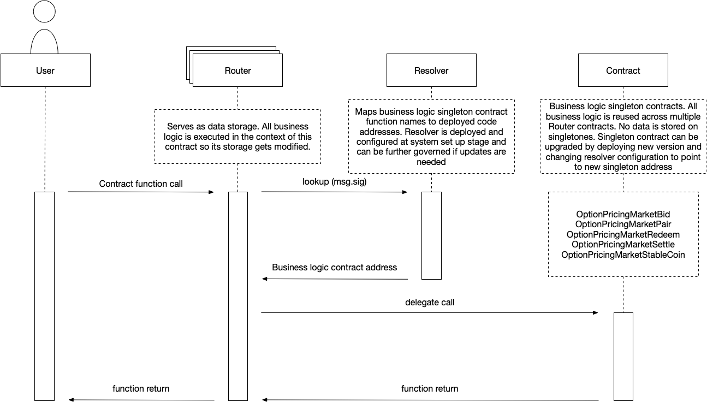

# EthereumSmartContracts
## General
Repo for all smart contracts deployed on Ethereum. Doesn't include contracts on any other chain.

This repo contains only Ethereum smart contracts related to the fixed income and stablecoin strike auction/markets. Does not contain contracts from the "bank protocol"

## Technical architecture
### Smart contract upgradeability
Contracts upgrades are handled using **Delegatecall-based proxy pattern** with more fine grained control over contract methods upgrades.

#### The key players are:
- **Router** - Keeps data storage. Delegates method invocation call to concrete contract logic implementation. Method is executed in the context of router by using `delegatecall` message call.
- **Resolver** - Maps business logic method names to address of deployed contract using first 4 bytes of Keccak hash (SHA3) of method signature. Additionally Keccak hash is stored to detect signature name conflicts during address updates.
- **Contract logic** - Concrete implementation of business logic. No data is stored in this contract. Can be upgraded by deploying new contract with modified logic and update signature in Resolver to point to new deployed contract.

#### Interaction
Following diagram shows contract interaction:

1. User calls Router contract method eg. `OptionPricingMarketBid.redeemTokens(...)`
2. Router using first four bytes of Keccak hash of `redeemTokens(uint256,address,uint256)` calls Resolver to get address of deployed contract logic.
3. Resolver returns address of deployed contract logic.
4. Router use `delegatecall` in fallback method on resolved address to execute logic of `redeemTokens(...)` in Router's context (data is stored on Router, not on deployed contract)
5. `OptionPricingMarketBid.redeemTokens(...)` is executed and returns transaction data to Router.
6. Transaction data is returned from Router to calling User.

#### Signature conflicts
Some signatures can have same first 4 bytes of Keccak hash eg. `tgeo()` and `gsf()`.

In order to avoid conflicts during method address upgrades full Keccak hash is stored in Resolver.
If during upgrade we detect conflict we check Keccak Hash. If the same Keccak hash is passed as param, upgrade is allowed. If Keccak hash is different upgrade transaction is reverted.

### Core contracts

#### Registry
Used by user with `governance` role to deploy Router for OPM contracts logic and keep track of valid deployed contracts.

#### TokenManager
Responsible for issuing new equity, debt, optionExecution tokens. Stores ethereumAddress and TokenWrapper.

#### TokenValidator
Stores whitelist of tokens that can be used by Bank as loan token or collateral tokens.

#### TokenWrapper
According to [article](https://medium.com/coinmonks/missing-return-value-bug-at-least-130-tokens-affected-d67bf08521ca), some ERC20 tokens do not return value for `transfer, transferFrom, approve` functions.
TokenWrapper implements safe methods that can handle non-compliant tokens. Using assembly we check if method execution was successful, even if no value was returned.

TokenWrapper should always be used when calling operations on external tokens.

#### SystemGovernance
Main governance contract, used as entry point for user with `governor` role to setup configurations of other contracts.

#### ExchangeConnector
Adapter contract that trades tokens and ethereum using external Kyber Network exchange.

#### OptionPricingMarket contracts
Core functionality which handles bidding, pairing, voting, settlement for options. Contract logic is split between multiple contracts because of 24kb size limit.
