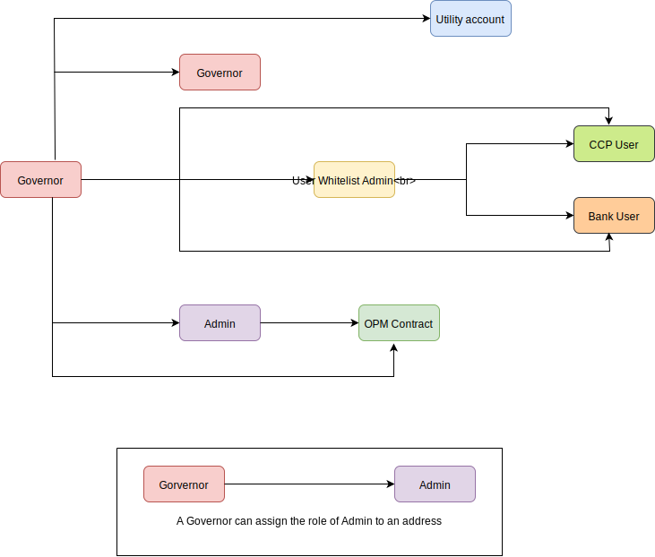

# Nomisma - Access Roles
This document describes all the user roles that exist in Nomisma Smart Contracts ecosystem, their hierarchy, the Smart Contracts they can interact with and the functions they are allowed to execute within the Smart Contracts.

# List of Roles

  - Governor
  - Admin
  - Utility Account
  - User Whitelist Admin
  - OPM Contract
  - CCP User
  - Bank User

     

The above diagram shows the relationships between different roles.

## Governor:
The Governor is a top level controller role within the Nomisma Smart Contracts ecosystem.
It is used to interact with deployed Nomisma smart contract for configurations.
Some of its functionalities include assign roles in RoleManager, modifying contract addresses and registering and updating signatures in Router contracts.
A Governor can assign any of the roles existing in Nomisma smart contract.

The following tables describe the Smart Contracts and the functions within them a Governor is able to interact with.

| Smart Contract | Function | Repository
| :------------- | :------------- | :------------- |
| RoleManager | appointGovernors| Ethereum Smart Contracts |
| RoleManager | appointAdmins | Ethereum Smart Contracts | 
| RoleManager | addRoleForAddress | Ethereum Smart Contracts |
| RoleManager | removeRoleForAddress | Ethereum Smart Contracts |
| DateKeeper | addValidators | Ethereum Smart Contracts |
| FixedValidator | replaceDates | Ethereum Smart Contracts |
| PeriodValidator | setMinIntervalSinceDeployment | Ethereum Smart Contracts |
| PeriodValidator | setPeriodInTheFutureEnabled | Ethereum Smart Contracts |
| PeriodValidator | setPeriodIntervalStart | Ethereum Smart Contracts |
| PeriodValidator | setPeriodIntervalEnd | Ethereum Smart Contracts |
| Resolver | bulkRegister | Ethereum Smart Contracts |
| Resolver | register | Ethereum Smart Contracts |
| Resolver | removeSignature | Ethereum Smart Contracts |
| Router | setResolver | Ethereum Smart Contracts |
| ExchangeConnectorMock | setExchangeRate | Ethereum Smart Contracts |
| ExchangeConnectorMock | toggleNonTradableUnderlying | Ethereum Smart Contracts |
| RegistryBase | setEventEmitter | Ethereum Smart Contracts |
| RegistryBase | setTokenManager | Ethereum Smart Contracts |
| RegistryBase | setExchangeConnector | Ethereum Smart Contracts |
| RegistryBase | setResolver | Ethereum Smart Contracts |
| RegistryBase | setTokenValidator | Ethereum Smart Contracts |
| RegistryBase | setDateKeeper | Ethereum Smart Contracts |
| RegistryBase | setUserValidator | Ethereum Smart Contracts |
| RegistryBase | setCompanyMapper | Ethereum Smart Contracts |
| TokenManagerAdmin | setBankRegistry | Ethereum Smart Contracts |
| TokenManagerAdmin | setOpmRegistry | Ethereum Smart Contracts |
| TokenManagerAdmin | setTokenWrapper | Ethereum Smart Contracts |
| ERC1400Permissions | setRegistry | Ethereum Smart Contracts |
| ERC1400Permissions | setController | Ethereum Smart Contracts |
| ERC1400Permissions | init | Ethereum Smart Contracts |
| ERC1644 | setControllable | Ethereum Smart Contracts |
| UserValidator | setIsEnabled | Ethereum Smart Contracts |
| FundLock | setRegistry|  Contingent Claims Protocol |
| OPMStableCoin | setStableCoinStrikeAuction | Contingent Claims Protocol |
| OPMRegistry | setDateKeeper | Contingent Claims Protocol |
| OPMRegistry | setFundLock | Contingent Claims Protocol |
| OPMRegistry | setStrikeValidator | Contingent Claims Protocol |
| OPMVoting | setExpertPrice | Contingent Claims Protocol |

## Admin:
Admin is a controller level role within the Nomisma Smart Contracts ecosystem.
Admin role is assigned by a Governor.
This role is used to modify contracts' business properties and such as setCommissionBeneficiary and minEquityBalance of BankRegistry contract.
An Admin can assign the role of OPMContract.

The following tables describe the Smart Contracts and the functions within them an Admin is able to interact with.

| Smart Contract | Function | Repository |
| :------------- | :------------- | :------------- |
| RoleManager | addOpmRoleForAddress | Ethereum Smart Contracts |
| ExchangeConnector | setExchangeRate | Ethereum Smart Contracts |
| ExchangeConnector | toggleNonTradableUnderlying | Ethereum Smart Contracts |
| TokenManagerAdmin | setEthereumAddress | Ethereum Smart Contracts |
| TokenValidator | addTokensToWhitelist | Ethereum Smart Contracts |
| TokenValidator | removeTokenFromWhitelist | Ethereum Smart Contracts |
| TokenValidator | addTokensToCcpWhitelist | Ethereum Smart Contracts |
| TokenValidator | removeTokenFromCcpWhitelist | Ethereum Smart Contracts |
| FundLock | setReleaseLockInterval | Contingent Claims Protocol |
| FundLock | setTradeLockInterval | Contingent Claims Protocol |
| OPMRegistry | deployOpm | Contingent Claims Protocol |
| StrikeValidator | init | Contingent Claims Protocol |
| StrikeValidator | replaceConditions | Contingent Claims Protocol |
| BankRegistry | setMinEquityBalance | Bank Protocol |
| BankRegistry | setCommissionBeneficiary | Bank Protocol |
| BankRegistry | setCommissionPercentage | Bank Protocol |
 
## Utility Account:
Utility Account role is used for the functions execution which are called from Nomisma backend scripts.

This account is assigned by Governors.

| Smart Contract | Function | Repository |
| :------------- | :------------- | :------------- |
| OPMMatch | matchOrders | Contingent Claims Protocol |

## User Whitelist Admin:
User Whitelist Admin is a second level role within the Nomisma Smart Contracts ecosystem.
User Whitelist Admin role can assign the roles of ccp.user and bank.user to the addresses.
User Whitelist Admin role is assigned by a Governor.

The following tables describe the Smart Contracts and the functions within them a User Whitelist Admi is able to interact with.

| Smart Contract | Function | Repository |
| :------------- | :------------- | :------------- |
| RoleManager | addUsersToWhitelist | Ethereum Smart Contracts |
| RoleManager | removeUsersFromWhitelist | Ethereum Smart Contracts |
| UserValidator | addUsersToWhitelist | Ethereum Smart Contracts |
| UserValidator | removeUsersFromWhitelist | Ethereum Smart Contracts |

## OPM Contract:
 OPM(Option Price Market) Contract role is assigned to the OPM contract address in the Contigent Claims Protocol.

 This role can be assigned by both Governor and Admin.

| Smart Contract | Function |  Repository |
| :------------- | :------------- | :------------- |
| OPMEventEmitter | emitBidReceived | Contingent Claims Protocol |
| OPMEventEmitter | emitBidWithdrawn | Contingent Claims Protocol |
| OPMEventEmitter | emitTransactionSettled | Contingent Claims Protocol |
| OPMEventEmitter | emitRedeemAvailable | Contingent Claims Protocol |
| OPMEventEmitter | emitTokensRedeemed | Contingent Claims Protocol |
| OPMEventEmitter | emitMintedRepresentationToken | Contingent Claims Protocol |
| OPMEventEmitter | emitPaired | Contingent Claims Protocol |
| OPMEventEmitter | emitOrderCanceled | Contingent Claims Protocol |
| FundLock | fundOpm | Contingent Claims Protocol |
| TokenManagerAssets | issueTokens | Ethereum Smart Contracts |

## CCP User:
CCP User role is assigned to the end users of CCP Protocol. The role enables addresses to access functionalties of CCP such as deposit, withdraw, bid and more.

This role can be assigned by both Governor and User Whitelist Admin.

| Smart Contract | Function |  Repository |
| :------------- | :------------- | :------------- |
| FundLock | deposit | Contingent Claims Protocol |
| FundLock | withdraw | Contingent Claims Protocol |
| FundLock | release | Contingent Claims Protocol |
| OPMBid | bid | Contingent Claims Protocol |
| OPMBid | withdrawBid | Contingent Claims Protocol |
| OPMRedeem | redeemTokens | Contingent Claims Protocol |
| ?OPMSettle | settleTransaction | Contingent Claims Protocol |
| StableCoinStrikeAuction | bid | Contingent Claims Protocol |
| ?StableCoinStrikeAuction | finaliseBidding | Contingent Claims Protocol |
| StableCoinStrikeAuction | withdrawBid | Contingent Claims Protocol |
| OPMVoting | vote | Contingent Claims Protocol |
| OPMVoting | payDividends | Contingent Claims Protocol |
| OPMVoting | finalizeVoting | Contingent Claims Protocol |

## Bank User:
Bank User role is assigned to the end users of Bank Protocol. The role enables addresses to access functionalties of Bank such as borrow, payBackLoans, depositEquity, depositDebt and more.

This role can be assigned by both Governor and User Whitelist Admin.

| Smart Contract | Function |  Repository |
| :------------- | :------------- | :------------- |
| BankBorrow | payBackLoans | Bank Protocol |
| BankBorrow | borrow | Bank Protocol |
| BankInvest | depositEquity | Bank Protocol |
| BankInvest | depositDebt | Bank Protocol |
| BankRedeem | redeemDebtTokens | Bank Protocol |
| BankRedeem | redeemEquityTokens | Bank Protocol |
| BankRegistry | deployBank | Bank Protocol |

Note:- The `Bank User` only restriction mechanism is not yet in place for some of the functions mentioned in the above table.

# Discussion Topic
In the Event Emitter contract of CCP we have functions restricted to only the OPM contract where only the OPM contract can call the external function. We are making  use of `onlyOPMContract` modifier from the roleManager implementation.

In the Event Emitter contract of Bank Protocol, we are using a local modifier which makes use of `isValidContract` function of the `RegistryBase` contract to restrict the external functions' access. The implementation of `isValidContract` function checks the contract's storage and see if the caller is a contract already registered in the Registry. The Registry does not seem to be exclusive to bank contracts' addresses and seems to contain non-bank addresses too.

In the case of CCP's Event Emitter contract we have restricted access of functions to OPM contract but in the case of Event Emitter contract of Bank Protocol a non-bank address might be able to successfully call the functions.

These methods currently need Governor role. It seems inconsistent as Governor is used for contract initial setup and configuration.
However these methods are setting contract business logic properties. In other places Admin role is used for that.

| Smart Contract | Function |  Repository |
| :------------- | :------------- | :------------- |
| FixedValidator | replaceDates | Ethereum Smart Contracts |
| PeriodValidator | setMinIntervalSinceDeployment | Ethereum Smart Contracts |
| PeriodValidator | setPeriodInTheFutureEnabled | Ethereum Smart Contracts |
| PeriodValidator | setPeriodIntervalStart | Ethereum Smart Contracts |
| PeriodValidator | setPeriodIntervalEnd | Ethereum Smart Contracts |
